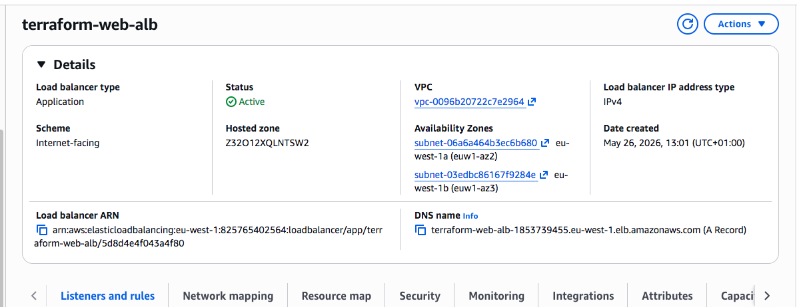
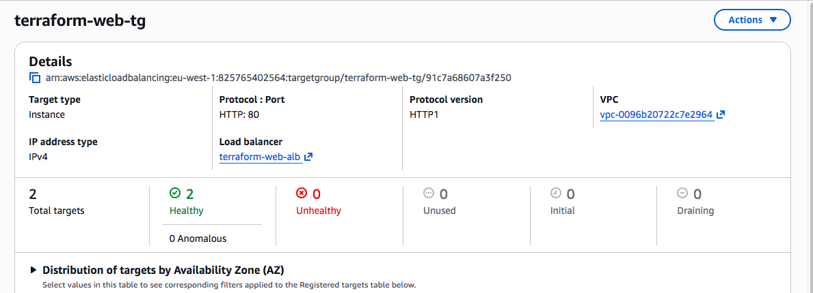
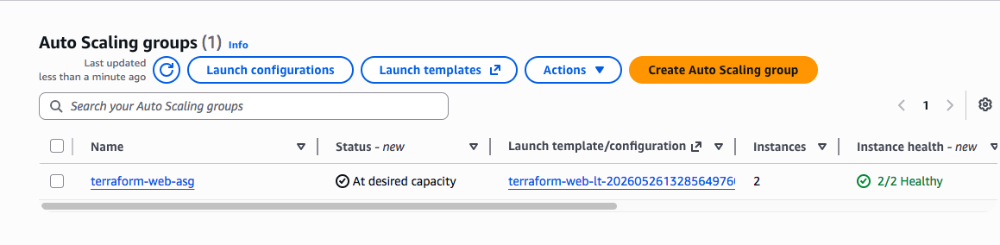
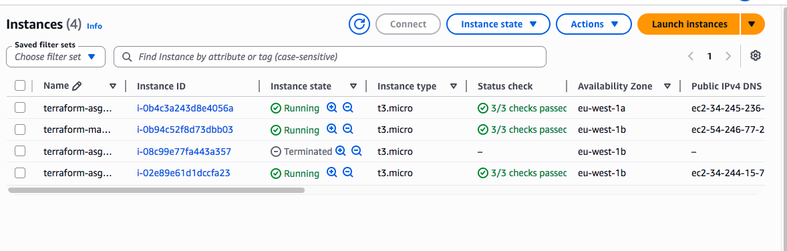
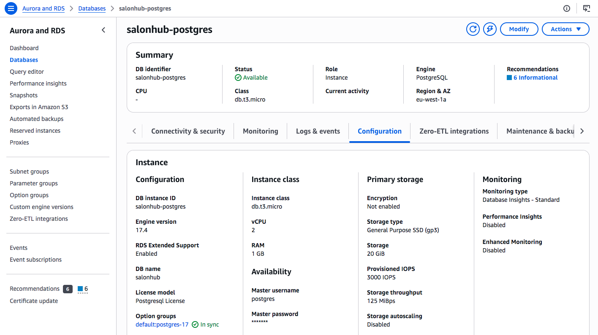
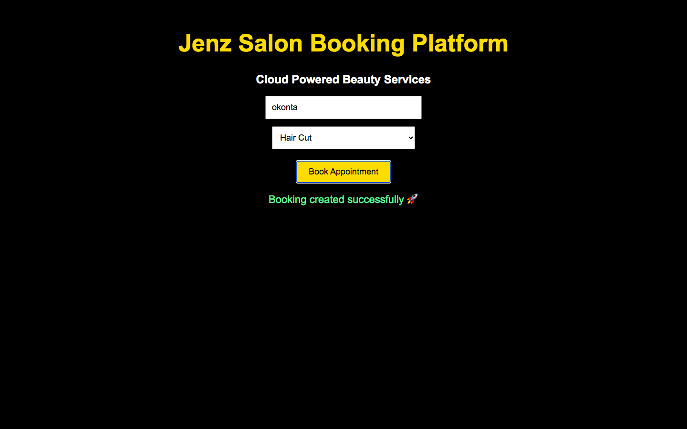
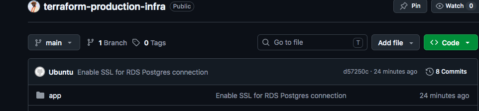

# Terraform Production Infrastructure

Production-style AWS infrastructure deployed with Terraform.

## Project Overview

This project provisions a highly available web application environment on AWS using:

- Terraform
- VPC
- Application Load Balancer (ALB)
- Auto Scaling Group (ASG)
- EC2 Instances
- PostgreSQL RDS
- Docker
- GitHub
- CI/CD Deployment

## Architecture

- Application Load Balancer
- Auto Scaling Group (2 Desired / 2 Minimum / 2 Maximum)
- Multiple EC2 instances
- PostgreSQL RDS Database
- Dockerized Frontend and Backend
- GitHub Source Control

## Screenshots

### Load Balancer

### Target Group

### Auto Scaling Group

### EC2 Instances

### RDS PostgreSQL

### Successful Booking Test

### GitHub Repository

## Key Achievements

- Built AWS infrastructure using Terraform modules
- Implemented Application Load Balancer
- Configured Auto Scaling Group
- Deployed Dockerized application
- Migrated database to PostgreSQL RDS
- Connected application successfully to RDS
- Implemented GitHub version control
- Tested successful booking workflow

## Author

Jolomi Ayu
